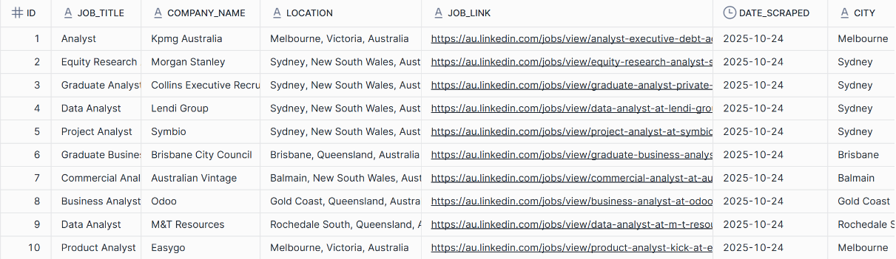

## Linkedin Entry Job Insights

This repository contains an automated pipeline that scrapes LinkedIn job postings, extracts skills and entities using a custom-trained spaCy NER model, and loads the structured data into Snowflake. The pipeline is orchestrated using Apache Airflow and can be run via Docker.

## Project overview

### Features
- Automated LinkedIn job posting scraper
- Custom NER model to extract skills, job titles, and locations
- Data cleaning and transformation pipeline
- Snowflake data warehouse integration
- Airflow orchestration

### Project Structure
```
linkedin-entry-job-insights/
├── dags/
│   └── linkedin_jobs_dag.py    # Main Airflow DAG definition
├── include/
│   ├── scrape_linkedin.py      # LinkedIn scraping logic
│   ├── data_processing.py      # Data cleaning utilities
│   ├── ner_model.py           # NER model wrapper
│   └── upload_data.py         # Snowflake upload logic
├── include/data_files/
│   ├── raw/                   # Raw scraped data
│   ├── curated/              # Processed CSVs
│   ├── model/                # Trained NER models
│   └── ner_data/            # NER training data
├── ner_config/
│   ├── base_config.cfg       # Base spaCy config
│   └── config.cfg           # Generated training config
├── docker-compose.yaml       # Docker services config
└── Dockerfile               # Airflow image definition
```

## Prerequisites

- Python 3.10+ (required for spaCy compatibility)
- For local setup:
  - Git
  - Python virtual environment tools
- For Docker setup:
  - Docker Desktop
  - WSL2 enabled (Windows only)

## Install

1. Create and activate a virtual environment:

```powershell
python -m venv .venv; .\.venv\Scripts\Activate.ps1
```

2. Install dependencies:

```powershell
pip install --upgrade pip; pip install -r requirements.txt
```

3. Install Apache Airflow (if you plan to run the Airflow DAGs):

```powershell
pip install "apache-airflow[celery]==3.1.0" --constraint "https://raw.githubusercontent.com/apache/airflow/constraints-3.1.0/constraints-3.10.txt"
```

4. Install a spaCy model:

```powershell
pip install spacy
# example: python -m spacy download en_core_web_lg
```

## Configure and Train NER Model

For a detailed walkthrough of spaCy NER model training, you can refer to this tutorial:
[Custom Named Entity Recognition with spaCy](https://www.youtube.com/watch?v=3LAY7rocJmg)

1. Update paths in `ner_config/base_config.cfg`:
   - Find the `paths` section
   - Update the path to `ner_data` folder with your absolute path
   - Example: `d:\your\path\to\include\data_files\ner_data`

2. Generate training config and train model:

```powershell
# Generate complete config
python -m spacy init fill-config ./ner_config/base_config.cfg ./ner_config/config.cfg

# Train model (can take 30+ minutes)
python -m spacy train ./ner_config/config.cfg --output ./include/data_files/model/
```

Training outputs:
- `model-best/` - Best model based on validation metrics
- `model-last/` - Final model state after training
- Training logs with metrics in the console output

## Quick local run & Airflow

You can run the pipeline in two ways:

### Option 1: Run with main.py (Quick CSV output)
For a quick local run that generates CSV files without Airflow or Snowflake:
```powershell
python main.py
```
This will:
1. Scrape LinkedIn job listings
2. Process the descriptions
3. Extract skills using the NER model
4. Save results to CSV files in `include/data_files/curated/`

### Option 2: Run with Airflow (Full Pipeline)
The complete pipeline is defined in `dags/linkedin_jobs_dag.py` and includes these tasks:
1. Scrape LinkedIn job listings
2. Clean and process job descriptions
3. Extract entities using NER model
4. Upload structured data to Snowflake

#### Run with Docker

Docker is the recommended way to run the full pipeline. The `docker-compose.yaml` sets up:
- Airflow webserver and scheduler
- PostgreSQL metadata database
- Redis for Celery task queue
- Celery workers

1. Install Docker Desktop (ensure WSL2 is enabled on Windows and Docker is running).

2. From the repository root, build and start the stack:

```powershell
mkdir -p ./dags ./logs ./plugins ./config
echo -e "AIRFLOW_UID=$(id -u)" > .env

# If using the standalone docker-compose binary
docker-compose up -d --build
```

3. Access Airflow web UI:
- Open http://localhost:8080 in your browser
- Default credentials: airflow/airflow
- The DAG should be visible and ready to run

4. When finished:
```powershell
docker-compose down -v
```

Notes:
- Required environment variables (add to `.env`):
  - `AIRFLOW_UID`: Your user ID
  - `SNOWFLAKE_USER`: Your Snowflake username
  - `SNOWFLAKE_PASSWORD`: Your Snowflake password
  - `SNOWFLAKE_ACCOUNT`: Your Snowflake account
  -  `WAREHOUSE` : Your Snowflake warehouse
  -  `SCHEMA` : Create schema with the name JOB_DETAILS and JOB_DESCRIPTIONS
  -  `DATABASE` : Create database with the name LINKEDIN_JOBS


## Sample Data Outputs

### In CSV
- Raw data: `include/data_files/raw/linkedin_jobs.csv`
- Processed data: `include/data_files/curated/linkedin_jobs.csv`
- Curated CSVs: `include/data_files/curated/` (e.g., `linkedin_job_descriptions_with_skills.csv`).

### In Snowflake
Access the processed job data in Snowflake:
https://app.snowflake.com/kdkpuxc/krb87373/w37f1VHiDYoA#query

